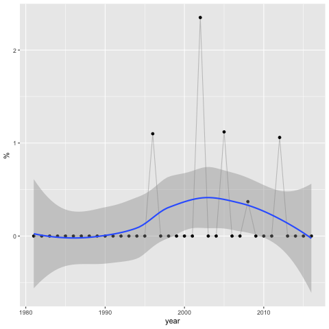
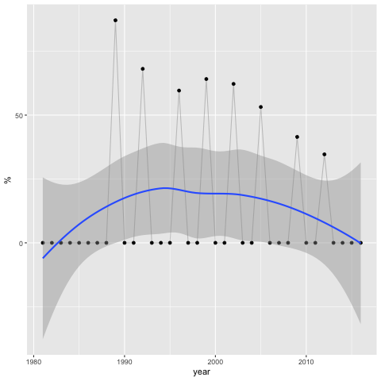

# API Highways : "Poverty Headcount Ratio at $1.90/day (2011 PPP) (% of Population)
###### 16/4/18 - 18/4/18

Following my [1st experience]("https://github.com/mbeveridge/SDG-API_Extreme-Poverty") of using [API Highways]("https://apihighways.org/data-sets"), I wanted to see whether the difficulties I had were typical (re. "whether the site would be a good source of datasets to practice on").

I hadn't intended to use 'the same' dataset as the 1st one (but from "World Bank Group", not "Data Development Hub"). But it caught my eye (on main page of API Highways, again) and I thought it may be a useful comparison.

As before, I wanted R for analysis, and Python code was on the dataset's page.

---

Didn't try an RMarkdown notebook, because last time it felt like **reticulate** may not work in my setup (yet), rather than my code being the issue. (This dataset's page didn't link to a csv version)

---

Began with `Extreme-Poverty.ipynb` from the '1st experience' and renamed it `Extreme-Poverty_(WorldBank).ipynb`. I found a way to exclude the "'meta' data at the end", and got the JSON data into a **pandas** dataframe (but still wonder if there's a way to do it 'more directly', with `pd.read_json(data)`).

Compared with the '1st dataset', this '2nd dataset' had a lot of columns (62). But 57 were the years 1960-2016, which could be more useful pivoted (into just 2 'Year' and 'ratio' columns).

This time, I also got the `df` dataframe from Python into R (via **rpy2**), and usable by **dplyr** and **ggplot2**. But I didn't find a way to maintain variables between R cells, so used just one cell for R in Jupyter.

---

Unfortunately '2nd dataset' was missing a lot of values. Firstly, everything in the years 1960-1980 was 'zero' (not `NA`), and similarly for most countries in following years ...That could be because collection hadn't begun. However, secondly, where '1st dataset' had non-zero values every year (eg. for Albania), this '2nd dataset' would exactly match (say) every 4th or 5th, and have 'zero' for the others. Given that they presumably have the same source, this was odd, and distorted the modelling & visualisations I'd hoped to try. So there's just one visualisation, to illustrate this.

_Albania, Uganda : % of population since 1980 (trend) :_

---

Comments :

* [RETRY?] RMarkdown with **reticulate**.
* [RETRY?] "do it 'more directly', with `pd.read_json(data)`".
* Taking `df` into R introduced a leading 'X' to all the year column headers (and the `_id` column). If I could do the pivot in Pandas (creating a non-numeric header), probably wouldn't need a step to strip the X's.
* [RETRY?] "didn't find a way to maintain variables between R cells". Wasn't sure of difference between `%%R` and `%R`.
* Only get an image for the final `ggplot` visualisation in a cell. So, if can't maintain variables, need to do the same initial cleaning for every new viz/cell?
* Missing data.
* Dataset had regional aggregate data as rows. Could (instead) try to JOIN `df` with `entity.csv` (from '1st experience'), to know the region of each country. (And remove the regional rows.)

